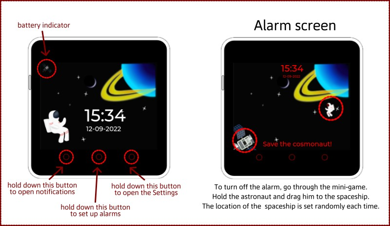
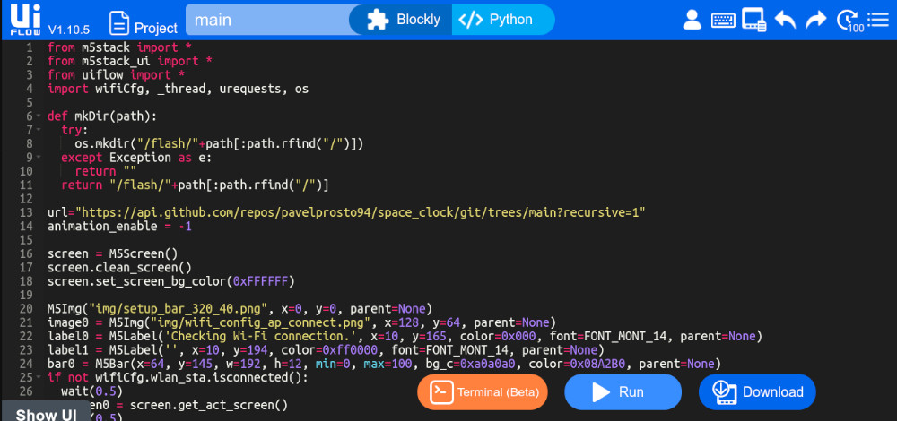

# space_clock
 Turn your M5Stack into a space clock

## What can they do:
- Animated space wallpaper with a flying astronaut
- Adaptive backlight mode will set the brightness depending on the time of day (Bright screen during the day and dim at night).
- Add up to 4 alarm clocks. You can set up a repeat by day of the week.
- Disable and activate alarms using the alarm clock manager.
- Using the settings menu, you can synchronize your watch with the time from the Internet, adjust the brightness of the screen, select an alarm ringtone.
- Connect to Wi-Fi using Wi-Fi Manager(No need to reboot your device)
- View the weather using OpenWeather API
- Run the any *.py scripts from app directory(Calculator, Timer, Weather and etc.).
- You can enter debug mode directly from the watch menu.

## I plan to add:
- Notifications:
  - Get notifications from your phone via Bluetooth.
  - Connect the Telegram bot to your M5Stack and receive any IFTTT notifications.
  - Localization

## Installation
- Using M5 Burner, install the current version of UIFlow_Core 2 (If you have a new device)
- Restart your device
- Select Flow > Wi-Fi
- Go to M5Flow (https://flow.m5stack.com /)
- Specify your "API KEY" and device type "Core2"
- Switch to Python mode
- Copy and paste the code to set the clock from the file (https://github.com/pavelprosto94/space_clock/blob/main/install.py )
- Click the Run button

- Wait for the installation to finish. All necessary files will be copied from the GitHub repository
- After restart the device
- Select App > space_clock.py > Run

A bug may occur, the clock is not drawn, and the Run button is lit blue. Don't worry, M5Stack has already specified this file as the default execution.
- Don't press anything and wait 10 seconds
- After that, the clock will start itself

## Update device
- Restart your device
- Select Flow > Wi-Fi
- Go to M5Flow (https://flow.m5stack.com /)
- Specify your "API KEY" and device type "Core2"
- Switch to Python mode
- Copy and paste **New install** code from the file (https://github.com/pavelprosto94/space_clock/blob/main/install.py )
- Click the Run button

- Wait for the installation to finish. All necessary files will be copied from the GitHub repository
- After restart the device
- Select App > space_clock.py > Run

## You can support me too.
I accept donation via [Webmoney](https://www.wmtransfer.com/). 

My Webmoney(WMZ) wallet: Z803753663501
Bitcoin wallet: [1HyvAY4r8S82KdJwiy6igwHEY49ExHtZjs](bitcoin:1HyvAY4r8S82KdJwiy6igwHEY49ExHtZjs?amount=0.0002)